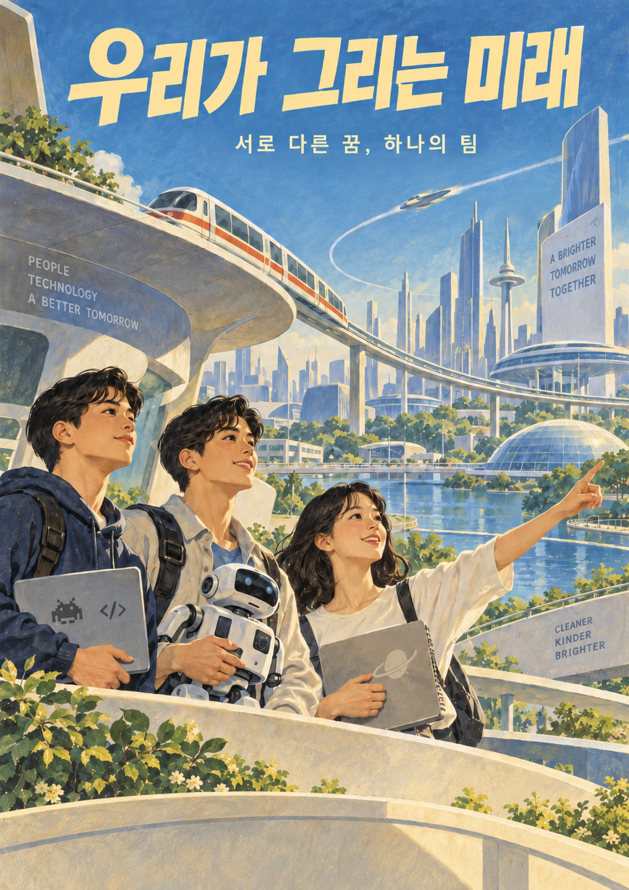
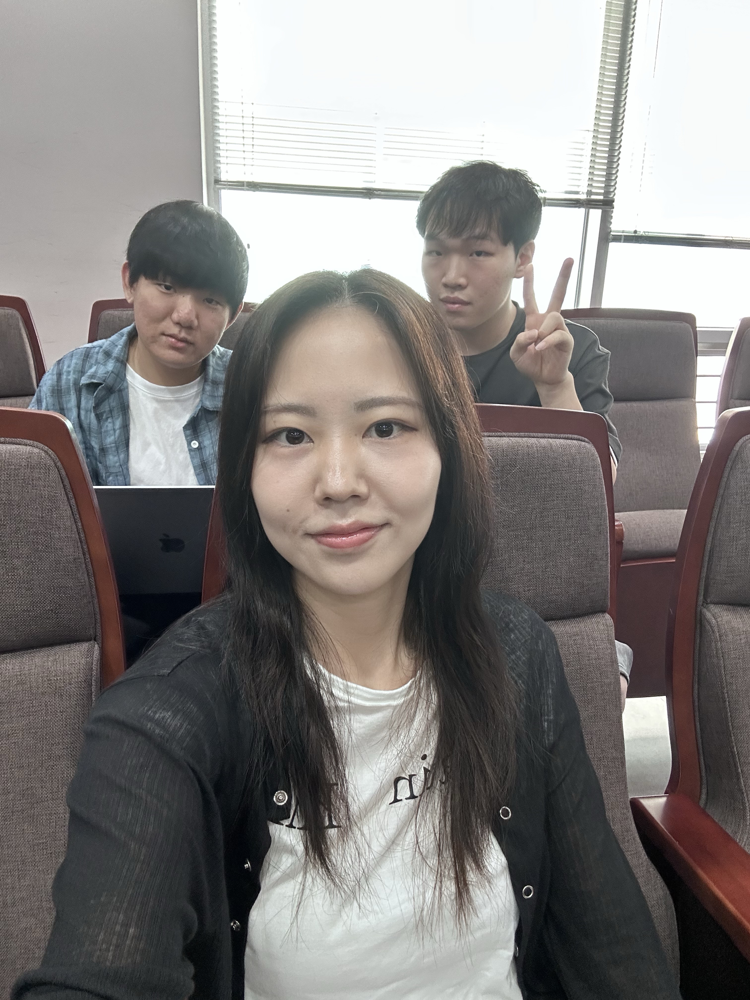

# Welcome to E26-SW01-17

## 🎯 팀 슬로건

> According to Coding

## 🖼️ 팀 포스터

***

## 1️⃣ 팀원 소개

| **이름** | **전공** | **관심사** |
| --- | --- | --- |
| **김진우** | 소프트웨어 | AI, 창업, 풀스택 |
| **김지호** | 소프트웨어 | SW, HW |
| **정영미** | 소프트웨어 | 취업, BE |

유레카프로젝트 팀 생성을 축하합니다.
팀의 제목과 슬로건, 팀원의 이름 및 관심사를 변경하세요.

### 팀 소개

4학년 화석과 1학년 청정수

***

## 2️⃣ 공통된 관심사 : SW, CS

***

## 3️⃣ 한학기 동안의 활동 내역 

<!-- 활동 사진 추가 예시 -->
- 첫날 팀 단체사진 

***

## 4️⃣ 인상 깊은 활동

- 활동명 – 활동에 대한 간단한 설명과 배운 점을 작성  
- 예: 멘토링에서 실리콘밸리 현업 경험을 들을 수 있어 진로 방향 설정에 큰 도움이 되었다.  

***

## 5️⃣ 특별히 알아보고 싶은 것
- 예: 현장실습 제도
- 예: 학부 졸업 인증 조건
- 예: 성취기반평가
- 예: 졸업 후 진로(대학원/취업)

***

## 6️⃣ 활동을 마친 소감

🔗학번 이름  
> "소감 내용을 여기에 작성합니다."

🔗학번 이름  
> "소감 내용을 여기에 작성합니다."

🔗학번 이름  
> "소감 내용을 여기에 작성합니다."

🔗학번 이름  
> "소감 내용을 여기에 작성합니다."

🔗학번 이름  
> "소감 내용을 여기에 작성합니다."